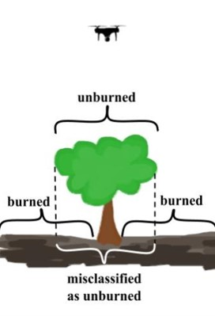
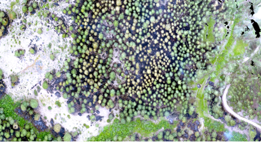
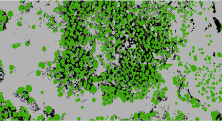
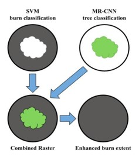
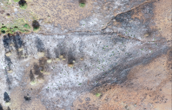
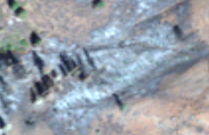
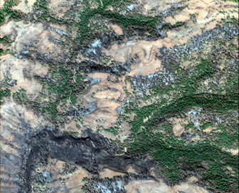
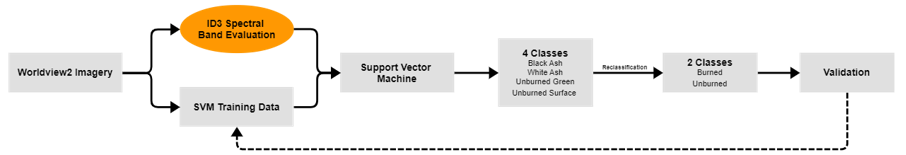
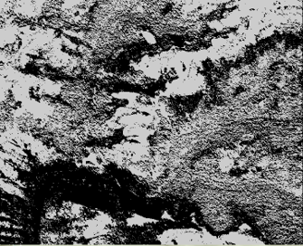

# Cole McCall

Hello, my name is Cole McCall, and I am currently seeking an entry-level role in software development or data science, preferably with an emphasis in GIS.

I graduate from Northwest Nazarene University in May 2023 with a major in Computer Science and concentrations in Data Science and Cyber Security. While attending NNU, my passion for working with software, data, and maps has continued to grow, with classes like Artificial Intelligence, Machine Learning, and Big Data Management challenging me to learn more and apply my absolute best efforts and abilities.

Outside of the classroom, I have worked as a research assistant for over 2 years, where I have worked with my team to use drone and satellite imagery to solve geospatial problems, such as mapping and predicting wildfires, using AI and Machine Learning. Additionally, I have provided help to fellow students and my professors as a teacher’s assistant, where I learned just how true it is that you don’t always know something until you teach it to others.

Ever since I began programming, I have discovered that I am someone that learns through doing, not just by watching and observing. As such, I have completed several projects during my college education, along with personal side projects and research projects that I have enjoyed. I have chosen to share a few of these projects here below.

# Research
Over the past few years, the size and severity of wildland forest fires have continued to increase, causing more damage and destruction around the world. New methods have been developed to utilize machine learning algorithms to map forest fire burn extent and fire severity using aerial imagery. Algorithms such as the Support Vector Machine (SVM) can be used to classify pixels as either black ash, white ash, or unburned, while the Mask Region-Based Convolutional Neural Network (MaskR-CNN) can be used to find and map tree objects. The results from these classifications can be used to help local wildland fire managers assess the burned area and create a recovery plan.
 
This research has several steps: 1) improving the current method for mapping burn extent with hyperspatial drone imagery, 2) using the same (or similar) methods to determine if wildland fire burn extent can be mapped with high-resolution satellite imagery, 3) evaluating how spatial and spectral resolution impacts the accuracy of the classification, and 4) try to develop new methods that involve less (or no) training data, such as unsupervised change detection. The results of each step were promising, creating much more accurate classifications of wildland fire burn extent than can be obtained by other common products such as LANDFIRE. This research will continue, likely moving in a direction that further examines the use of unsupervised and self-supervised machine learning, which greatly reduces the training data needed.

## Mapping Wildfires with Drone Imagery using Machine Learning
**Project Description:** 
Based on previous research, machine learning algorithms such as the Support Vector Machine (SVM) have been used to accurately map the burn extent of wildland fires, whereas a Mask Region-Based Convolutional Neural Network (MaskR-CNN) could be used to detect tree objects. Since surface vegetation on the ground may be obstructed by tree crowns above (Figure 1.1), the aerial imagery captured by drones may produce an inaccurate mapping of the burn extent (Figures 1.2 and 1.3), observing the tree crown on top instead of the possibly burned vegetation underneath. To enhance the burn extent classification, a program was developed to find all tree objects completely surrounded by burned areas and reclassify those tree objects as burned regions since the areas underneath the tree crown were burned, even though the tree crown itself did not burn (Figure 1.4). 

Figure 1.1 - A difficulty of using Drone Imagery to Map Burn Extent

Figure 1.2 - Drone Imagery of the Hoodoo Fire

Figure 1.3 - Low Accuracy Burn Extent Classification

Figure 1.4 - How the Burn Extent Map can be Improved
- Use a Support Vector Machine to Locate Burn Pixels
- Use a MaskR-CNN to locate tree objects
- Create a combined raster with 3 classes (trees, burned, unburned)
- Reclassify areas that experience sub-crown surface fire

Additionally, support vector machine classifiers needed to be trained and used for each study area, taking into consideration that a model may work on one fire area, but not the others.

Based on hand-drawn validation data, the accuracy increased from 59.5% to 86.7%. The results of this project were published in an article in the Remote Sensing journal titled “Mapping Forest Burn Extent from Hyperspatial Imagery Using Machine Learning”, which is available to read [here](https://www.mdpi.com/2072-4292/13/19/3843)

**Responsibilties/Impact:**

- Used ArcGIS Pro to digitize polygons of burned areas that were used to calculate the accuracy of the burn extent classification
- Used ArcGIS Pro to train new SVM's for each of the 4 fires, including training data from each fire
- Implemented an SVM in C++ to classify burn extent, which could be compared with the classification created from ArcGIS.
- Developed the reclassification program that detects and reclassifies trees completely surrounded by burned areas.

## Evaluating the Impacts of Spatial and Spectral Resolutions in using Satellite Imagery for Classification
**Project Description:** Even though hyperspatial drone imagery can accurately map burn extent, it can be difficult and time-consuming to collect/acquire drone imagery. Additionally, mapping the burn extent involves utilizing an SVM classifier that must be trained to the image, a MaskR-CNN that must be trained to detect trees, and an additional program to enhance the burn extent created by the SVM classifier. For these reasons, the FireMAP research team began to study how substituting 5cm spatial resolution drone imagery for lower 1.5 to 3m spatial resolution satellite imagery affected the accuracy of mapping burn extent. 

Figure 2.1 - 5cm Spatial Resolution Drone Imagery

Figure 2.2 - 1.84m Spatial Resolution Worldview2 Imagery

Figure 2.3 - Worldview2 Image of the Mesa used as Input for Burn Extent Classification

Figure 2.4 - Burn Extent Classification Process

Figure 2.5 - Resulting Burn Extent Classification

While this high-resolution satellite imagery has a lower spatial resolution (~1.5 to 3m instead of 5cm), the satellite imagery has a higher spectral resolution, containing eight multispectral bands as opposed to the typical Red, Green, and Blue (RGB) bands of an image. When using satellite imagery instead of drone imagery, the higher spatial resolution is swapped for a higher spectral resolution, introducing bands like Red Edge, Yellow, and Near Infrared into the mix. The changes in resolution between images created another aspect to this research: evaluating how spatial resolution and spectral band selection impact the accuracy of a burn extent classification. Two sets of satellite imagery were used to explore these ideas: ~1.8m spatial resolution Worldview2 imagery and ~3m spatial resolution PlanetScope imagery.

A manuscript is currently being developed for evaluating spatial resolution and spectral band selection with Worldview2 imagery. 

A separate manuscript for mapping burn extent from PlanetScope imagery is expected to begin development this summer.

**Responsibilties/Impact:**
- Created an Iterative Dichotomiser 3 (ID3) Decision Tree program in C#
- Using the ID3, performed entropy analysis on each of the spectral bands in Worldview2, determining which bands are most useful for mapping burn extent
- Used Principle Component Analysis (PCA), to reduce the spectral dimensionality (from 8 bands to 3 bands)
- Mapped burn extent using a variety of transformed Worldview2 imagery sources:
    - RGB Worldview2 Imagery (Baseline)
    - 8 Band Worldview2 Imagery
    - ID3-Selected Spectral Band Worldview2 Imagery
    - PCA-Transformed Worldview2 Imagery
- Mapped burn extent with an average 94% accuracy using Worldview2 imagery
    - The baseline RGB had a slightly lower accuracy of 91%
    - Accuracy increased when using PCA or ID3 (to 95%)
    - The additional spectral bands may help the SVM differentiate between shadows and burned areas better

## Unsupervised Wildfire Change Detection
**Code:** [https://github.com/spaceml-org/FireCLR-Wildfires](https://github.com/spaceml-org/FireCLR-Wildfires)

**Project Description:** In the summer of 2022, NNU’s summer research team assisted in the FDL-US 2022 Wildfire Challenge, at Frontier Development Lab (FDL). The wildfire research team was given a challenge by the U.S. Department of Energy to determine if “... ML-enhanced tools can be used to prevent fires from starting or new fires from combining to create mega-fires". The FDL-US 2022 Wildfire team wanted to use machine learning algorithms to map burn extent from satellite imagery. However, this team wanted to use self-supervised learning instead of supervised learning methods that require large amounts of training data. 
 
 Additionally, the wildfire team partnered with Planet, who gave the team access to ~3m spatial resolution PlanetScope imagery, with near-daily updates, which gave the team even more opportunities. This project aimed to use the PlanetScope imagery to perform daily wildfire change detection, which could then be used to predict wildfire changes in simulation. An advanced deep learning technique called contrastive learning was used to perform unsupervised change detection, which resulted in detecting burn area change. The results of this project were published in “Unsupervised Wildfire Change Detection based on Contrastive Learning”, which can be found [here](https://arxiv.org/abs/2211.14654)

 **Responsibilties/Impact:**
 - Attended FDL-US 2022 at the SETI Institute in Mountain View, California
    - Sponsored by the Department of Energy
    - Partnered with Planet
- Worked in a team of 6, comprised of Ph.D.s, Ph.D. students, and postdocs, researching how Machine Learning can be used to prevent and/or limit the devastation of wildfires
- Helped brainstorm, plan, and design the system used: unsupervised change detection
- Downloaded TB's of satellite imagery from Planet, using developer API's in Python
- Processed and normalized downloaded satellite imagery
- Worked with the team to provide the data they needed, creating scripts that could be used to download data from a variety of sources, including Sentinel-2 imagery, MTBS data, LANDFIRE fuels data, and boundary polygons

# Projects

## Artificial Intelligence
During the Spring 2021 semester, I signed up for NNU's COMP4220 Artificial Intelligence as a Sophomore Computer Science student. This was an amazing class for me, as I was really pushed, both conceptually and technically. Throughout the course, I developed programs in C++ that used AI, several of which can be seen down below. While these projects started as homework assignments, they quickly progressed into fun challenges that I wanted to solve and take above and beyond.

### Playing Connect Four with AI
**Project Description:** Using the negamax algorithm, I created a bot/agent in C++ that can play Connect Four, against either another bot or a human.

Each student made there own bot, and competed 1 vs 1 with every other student. To improve my bot's chances of winning, I implemented extra features in addition to an adverserial search algorithm, such as alpha-beta pruning, creating a custom heuristic that ranks and prioritizes certain columns, a win first function that always makes the winning move if it's available, and prevent loss function that always blocks an opponents game winning move.

**Code:** [https://github.com/colemccall/Connect_Four](https://github.com/colemccall/Connect_Four)

### Cracking the Code with Genetic Algorithms
**Project Description:** I created a program in C++ that can read in a ciphered message and decipher it using a genetic algorithm.

**Code:** [https://github.com/colemccall/Genetic_Algorithm_Cipher_Buster](https://github.com/colemccall/Genetic_Algorithm_Cipher_Buster)

### Finding the Best Path on a Map
**Project Description:** I created that calculates the best path between two points, given a starting point and ending point on a map. The program can calculate the path based on time, money, or distance, depending on what the user considers cost.

**Code:** [https://github.com/colemccall/Pathfinder](https://github.com/colemccall/Pathfinder)

## General Education Data Science
**Project Description:** During my Senior year, I started a project in the Advanced Database Management course, which turned in a part-time project that I am still consulting/advising on. Based on course and student data stored in spreadsheets, our team of 3 was tasked with cleaning, storing, and finding patterns in the data, which was used to provide insights into which general education courses are being properly assessed, and how to predict this information in the future.

**Code:** [https://github.com/colemccall/NNU_Gen_Ed_Data_Science](https://github.com/colemccall/NNU_Gen_Ed_Data_Science)

## Computer Vision for Rocksat-X 2021
**Project Description:** As part of Northwest Nazarene University's Rocksat-X 2021 Project, two robotic arms were created, mounted onboard a sounding rocket, launched into space by NASA, and attempted to throw and catch a ball in space using Deep Meta Reinforcement Learning (DMRL). 

My role involved training and implementing a MaskR-CNN (using TensorFlow) for the robot to detect objects in motion.

**Code:** [https://github.com/colemccall/RockSatX2022_Object_Detection](https://github.com/colemccall/RockSatX2022_Object_Detection)

**Project**: [https://github.com/aborger/Marsha](https://github.com/aborger/Marsha)

# Links
- [LinkedIn](https://www.linkedin.com/in/colemccall/)
- [GitHub](https://github.com/colemccall)
- [Resume](Cole%20McCall%20April%202023%20Resume.pdf)